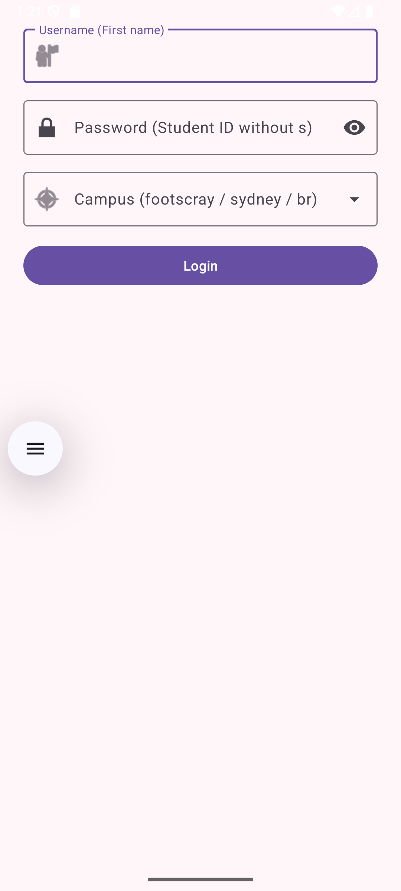
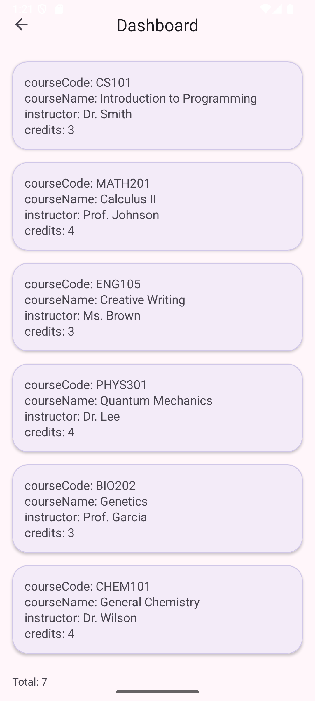

# Course1 — Android Application Development Project (NIT3213)

An Android app with **Login → Dashboard → Details** integrating the **vu-nit3213-api**.  
Implements **MVVM**, **Hilt** DI, and **Retrofit/OkHttp/Gson** for networking.

---

## Tech Stack
- Kotlin, AndroidX (Activity, RecyclerView, ViewBinding), Material 3
- **Retrofit + OkHttp + Gson** (API)
- **Hilt** for dependency injection
- **Coroutines** (suspend functions)
- Unit tests: **JUnit4**, **MockK**, **kotlinx-coroutines-test**

---

## Screenshots
| Login                    | Dashboard                        | Details                      |
|--------------------------|----------------------------------|------------------------------|
|  |  |  |

---

## API
**Base:** `https://nit3213api.onrender.com/`

### Auth (POST `/{campus}/auth`)
- `campus` ∈ `br` | `sydney` | `footscray`
- **Body**
```json
{ "username": "YourFirstName", "password": "YourStudentID" }
